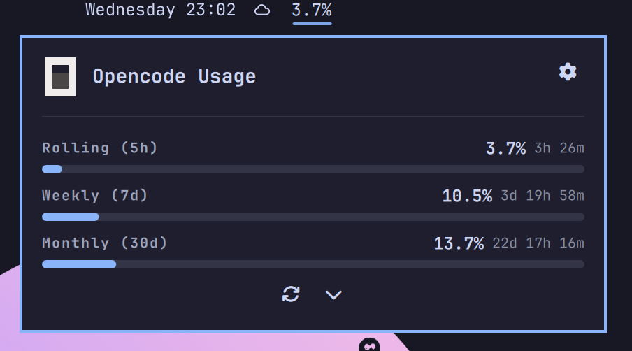

# OpenCode Usage for Omarchy

Unofficial bar widget for [Omarchy](https://omarchy.org) that shows your `opencode-go` usage directly in the bar: **Rolling 5h / Weekly 7d / Monthly 30d** + recent token histogram. **No credentials needed** — auto-reads key from `~/.local/share/opencode/auth.json`.


## Preview



Bar shows weekly `%` (e.g. `15%`). Panel shows bars for `5h ($12) / Weekly ($30) / Monthly ($60)` with `resets in` countdown + pace, and last 7 days tokens from `opencode.db`.

## Installation

```bash
omarchy plugin add https://github.com/srsergi0/omarchy-opencode-usage.git --enable --yes
omarchy bar add io.github.srsergi0.omarchy-opencode-usage --section right
```

Manual:

```bash
cp -r . ~/.config/omarchy/plugins/io.github.srsergi0.omarchy-opencode-usage/
omarchy-shell shell rescanPlugins
omarchy plugin enable io.github.srsergi0.omarchy-opencode-usage
```

## How it works (no credentials)

Al igual que `local.opencode-go`, no pide Workspace ID ni cookie:

- Lee la key automáticamente de `~/.local/share/opencode/auth.json` (`opencode-go` entry) — la que crea `opencode auth login`.
- Hace `curl -H "Authorization: Bearer $key" https://opencode.ai/zen/go/v1/usage` (`collector.sh:7`).
- Si no hay key muestra `No API key`. Si hay, muestra `Go · 15%` con `Rolling / Weekly / Monthly`.

Historial reciente: lee `~/.local/share/opencode/opencode.db` (tabla `message` con `providerID='opencode-go'`) para sumar tokens de los últimos 7 días (`collector.sh:27`). No requiere red.

Refresco cada 300s (configurable 60–3600s en settings). Click izquierdo abre panel, click derecho/medio refresca.

## Configuration

Bar widget settings → `Refresh interval (seconds)` (default 300). No hay más que configurar.

Validate:

```bash
omarchy plugin validate ~/.config/omarchy/plugins/io.github.srsergi0.omarchy-opencode-usage
./collector.sh | jq .
```

## Troubleshooting

- **No API key / 0%:** `cat ~/.local/share/opencode/auth.json | jq '."opencode-go"'` debe tener `.key`. Haz `opencode auth login` de nuevo.
- **HTTP 401/403:** key vencida, re-login.
- **No recent tokens:** `opencode.db` aún no tiene mensajes con `opencode-go`.
- **Bar not visible:** `omarchy plugin list` → enabled, luego `omarchy bar move --section right io.github.srsergi0.omarchy-opencode-usage`.

## Development

```bash
cp BarWidget.qml Panel.qml Model.js collector.sh ~/.config/omarchy/plugins/io.github.srsergi0.omarchy-opencode-usage/
omarchy-shell shell rescanPlugins; omarchy restart shell
```

## License

MIT — unofficial, not affiliated with `opencode.ai` or `Omarchy`.
